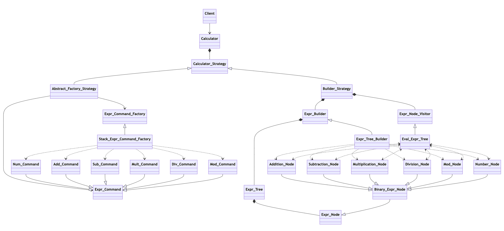
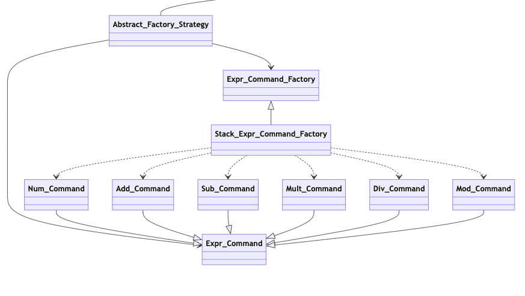
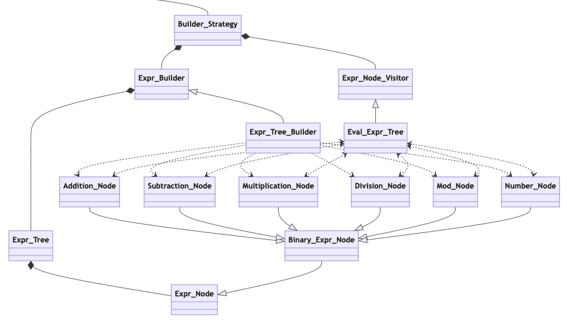

# **Software Design Pattern Calculator**
## _A command-line calculator program that demonstrates essential software design patterns._

This program focuses on practicing various software design patterns that I learned from my Software Design Principles class at IUPUI. Throughout the semester, we continued to build on what we previously learned until we came to a final result of two separate versions of a simple calculator program where each version applied different design patterns. This project combines those two versions into an example system where a client would make use of the calculator through an interface that allows the client to solve simple mathematical expressions using either selected solving strategy. Both strategies make use of several utility classes that I also implemented for this class, which contain data structures such as a fixed-size array, resizable array, stack, and queue.

The program focuses primarily on demonstrating various software design patterns rather than creating a useful expression calculator tool. This means that the design is somewhat overkill for a calculator, but it was never meant to be a daily-use calculator app in the first place.

### **Disclaimer**
I am not responsible for any plagiarism of my work. This project's visibility setting is set to public so it can be seen as a portfolio piece, not as a reference for how to complete the same assignments from the Software Design Principles class. 

## Building and Running the Program
This program uses a makefile generated by [Makefile Project Creator](https://github.com/DOCGroup/MPC) (MPC). The makefile has several commands for compiling and executing the program.

- Use ```make``` to compile all object files in the project.
- ```make run``` will compile and run the calculator program with no strategy selected. The program will then prompt the user to choose a strategy to continue with. Running ```./calculator``` after compiling the program with ```make``` will produce the same result.
- ```make factory``` will compile and run the program with the abstract factory pattern strategy selected. Running ```./calculator -f``` after compiling the program with ```make``` will produce the same result.
- ```make builder``` will compile and run the program with the builder pattern strategy selected. Running ```./calculator -b``` after compiling the program with ```make``` will produce the same result.
- ```make driver``` will compile and run the program where it will conduct all tests in the driver file before continuing to the main calculator program.
- ```make clean``` will remove all compiled object files, but leave the most recent compiled executable.
- ```make realclean``` will remove all compiled object files, including executables.

## Using the Calculator
This calculator program supports several simple mathematical operations, such as addition, subtraction, multiplication, division, and modulus. The calculator also supports sub-expressions contained in parentheses. To make it easier to parse the expressions, the main requirement for entering expressions is for each term to be separated by a space, including parentheses. For example, a valid expression would look like "4 + 3 * ( 2 % 1 )".

### Valid Expressions
Since this program focuses more on design patterns than creating a perfect calculator system, it is assumed that expressions entered will produce a valid result. There are several factors that must be considered when creating a valid expression.

Expressions must be composed of positive integers, and their solution must equal a positive or negative integer. Expressions containing floating point values and negative integers will result in an invalid expression. Single term inputs will not be considered as an expression, so entering “5” will produce an invalid result. Sub-expressions enclosed in parentheses act as a single term as well. The result of the sub-expression will replace it as the term. This means that entering “( 2 * 7 )” will produce an invalid result, as its answer (14) will replace the sub expression, leaving a single term. Therefore, shorthand for multiplying against parentheses will also create an invalid result. For example, the expression “4 ( 3 - 2 )” will produce an invalid result, where “4 * ( 3 - 2 )” will produce a valid result of 4. 

### Sample Expressions
- 6 / 3 + 3 * ( 2 + ( 7 - 5 )
- 5 * ( 2 + 1 ) - 2 * ( 8 - 3 )
- 4 + 3 / 1 * 2 - 3
- ( 5 % 4 + 9 ) / 2 - ( 15 * 1 - 12 )
- 2 * ( 9 - 3 * 2 ) / 2
- ( 3 + 5 ) / ( 1 * ( 7 - 3 ) )
- 9 - 5 + 2 + 6 - 4 * 2
- 7 * ( 5 - 3 ) - 4 + 6 / 3

## Class Design and Patterns Used


This program demonstrates eight essential software design patterns. These patterns are discussed below, alongside some specific classes from the program.

### Calculator and the Strategy Pattern
The calculator class will have an instance of a concrete child of Calculator_Strategy. The chosen strategy will solve an expression given to it by the calculator class using its corresponding algorithm. The two strategies used are Abstract_Factory_Strategy and Builder_Strategy, both of which implement concrete versions of the solve() and result() abstract methods from Calculator_Strategy. The strategy pattern is useful here becuase different algorithms can be decided on and used at runtime, but the solve() and result() methods will appear to work the exact same to the calculator class.

### Abstract Factory and Command Patterns


The abstract factory and command patterns are used by the Abstract_Factory_Strategy class. This strategy's algorithm parses through the expression, converting the expression from infix notation to postfix notation. As the algorithm does this, it is creating a command for each term using the Stack_Expr_Command_Factory class and storing it in a resizable array. The order in which the commands appear in the array correspond to where they appear in the postfix expression. Once the expression has been parsed and all commands have been created in postfix order, the strategy can loop through each command in the array to execute the command, solving the equation. The abstract factory pattern was useful for encapsulating how to build the array of commands in postfix order. The command pattern helped evaluate the expression based on the postfix order.

### Builder, Composite, Template, and Visitor Patterns


The Builder_Strategy class has a lot more moving parts in it, but it is equally as interesting as Abstract_Factory_Strategy. The builder strategy's algorithm makes use of the Expr_Tree_Builder class which builds a tree of composite nodes as the strategy parses the given expression. Each composite node corresponds to either an operand or operator. The tree's structure has operands as the leaves and operators as internal nodes. Since all of the operators available have binary operations (meaning the operator will have a term to its left and its right), a template method is used in the builder called build_binary_method(). The Eval_Expr_Tree class is used as a visitor object to traverse this tree and calculate the result of the expression. The visitor is able perform the correct operations because each composite node can accept the visitor, telling it which operation to perform.

The builder pattern helped encapsulate building the expression tree in this strategy. The template pattern was used by the builder to perform the same building algorithm for different binary expression nodes. Using the visitor pattern made it so that the expression tree could be traversed while calculating the result of the expression at the same time. The composite pattern aided the visitor by adding functionality to each node so that the visitor knew which operation to perform on what nodes.

### Facade (Wrapper) Pattern
Not shown in the class diagrams above is the facade pattern, also known as the wrapper pattern. This pattern is used by the driver classes, which are classes used for testing classes in the program. The facade pattern in this program provides a single interface for a client to run specific or all tests in the driver. The driver's methods simply call methods from other driver classes; these classes assigned to different modules in the system. Currently the driver only calls methods from the Utils_Driver, but more drivers can be created for testing other parts of the program.
